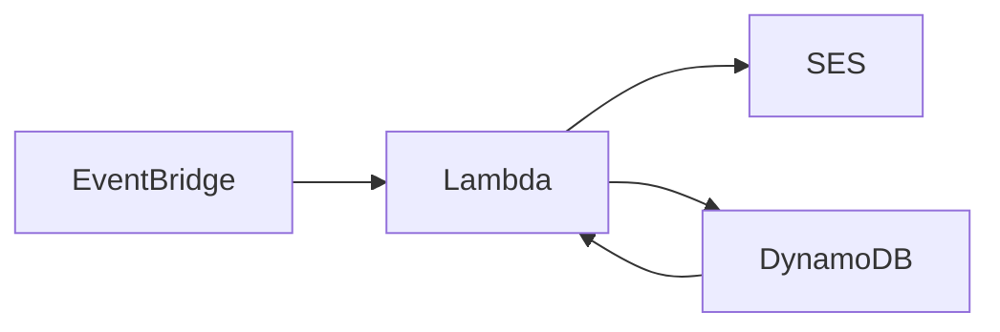

# AWS JYSK Price Alert

Price alert function for watching products on JYSK furniture store's website. Built on AWS infrastructure and Node.js.

## Description

This project utilizes AWS EventBridge, Lambda, DynamoDB and Simple Email Service (SES) in order to watch selected products on JYSK furniture store's website (but can be forked for any other webshop basically) and send you an email alert when the prices go below your threshold.

The Lambda function runs by a CRON schedule, scrapes the products and sends you an email via SES if the criteria for a product is matched.

## How to use

This repo contains the code for the Lambda function. You can set up the AWS infrastructure for it manually based on the instructions below.

### If you want to change the code

#### Dependencies

- npm
- Node.js
- The build command is written for MacOS

#### Building

For the first time make sure that you run `npm install` in the project root folder.

To build the script for Lambda, run `npm run build`
This creates a `lambda.zip` file, which you can upload in the Lambda Console.

### AWS infrastructure

1. Set up your desired email addresses in AWS SES for email sending.
2. Create a Node.js Lambda function and upload the `lambda.zip` file from this repo.
   It's recommended to raise the default 3s timeout and memory limit to avoid errors.
3. Assign a proper IAM Role to the Lambda function to be able to use SES and DynamoDB (`AWSLambdaBasicExecutionRole`, `AmazonSESFullAccess`, `AmazonDynamoDBFullAccess`)
4. Create a DynamoDB table and add the products you want to watch in the following format:

- `productUrl` (partition key): https://jysk.hu/nappali/fotelek/fotel-abildskov-elektromos-szurke-szovet
- `targetPrice`: 125000

5. Set the following environment variables for the Lambda function:

- `FROM_EMAIL` and `TO_EMAIL` - in accordance to your config that you've set up before in SES
- `DB_TABLE_NAME` - the name of the DynamoDB table you created

6. Create and assign a trigger for the Lambda function in EventBridge:

- Rule type is `Schedule`
- Schedule pattern is up to you, it can be `cron()` to run at a specific time or `rate()` to run at a regular rate (such as every 2 hours)
- Target is your Lambda function

The Lambda function will load the data from the DynamoDB table, iterate through the products, scrape their price and send you an email when the price of a product goes below the `targetPrice`. After successfull alerting it adds a flag for that product in the DB, so it won't notify you again. You can update the list of watched products in the DynamoDB console manually.
